# 🔮 Confidential Prediction Market

A privacy-preserving prediction platform built with **FHEVM (Fully Homomorphic Encryption Virtual Machine)**. Users can make predictions on binary outcome events while keeping their predictions completely private using on-chain encryption. No betting or financial aspects - pure prediction tracking with cryptographic privacy.

Author: [@Gengarthedev](https://x.com/Gengarthedev)

---

| Contract Name | Network | Contract Address |
|--------------|---------|------------------|
| ConfidentialPrediction | Sepolia | [`0xfD012bc5529AD1C08EF7C647AF64129437074892`](https://sepolia.etherscan.io/address/0xfD012bc5529AD1C08EF7C647AF64129437074892) |

---

## 📖 Concept

The Confidential Prediction Market revolutionizes prediction platforms by combining blockchain transparency with **cryptographic privacy**. Traditional prediction markets expose all predictions publicly, which can influence crowd behavior and compromise privacy. This solution leverages **homomorphic encryption** to keep predictions encrypted on-chain while still enabling verification of correctness after resolution.

### Key Features

- **🔒 Private Predictions**: All predictions are encrypted using FHEVM technology
- **❓ Binary Markets**: Simple Yes/No questions with clear outcomes
- **🎯 Deadline-Based**: Markets have clear deadlines for making predictions
- **✅ Resolution Tracking**: Check if you predicted correctly after market resolution
- **⚡ Self-Relaying Decryption**: Instant decryption with cryptographic proofs (FHEVM v0.9)
- **🔐 Zero-Knowledge**: Your predictions remain encrypted until you choose to decrypt them
- **🚀 User-Controlled**: Users sign and submit their own decryption requests
- **🎭 Privacy-First**: No one can see your prediction until you reveal it

---

## 🏗️ Architecture Overview

The platform consists of two main layers: **Smart Contracts** (on-chain logic) and **Frontend Application** (user interface with FHEVM integration).

### Smart Contract Architecture

```
┌─────────────────────────────────────────────────────┐
│         ConfidentialPrediction Contract             │
├─────────────────────────────────────────────────────┤
│  - Market Management                                │
│  - Encrypted Prediction Storage                     │
│  - Resolution Logic                                 │
│  - Decryption Workflow (v0.9 Self-Relaying)         │
└─────────────────────────────────────────────────────┘
                         │
                         │ Uses
                         ▼
┌─────────────────────────────────────────────────────┐
│              FHEVM Library (Zama)                   │
├─────────────────────────────────────────────────────┤
│  - FHE.asEbool() / FHE.fromExternal()               │
│  - FHE.makePubliclyDecryptable()                    │
│  - FHE.checkSignatures()                            │
│  - FHE.allow() - Permission management              │
└─────────────────────────────────────────────────────┘
```

---

## 🔄 Application Flows

### 1. Market Creation Flow


### 2. Make Prediction Flow


### 3. Market Resolution Flow


### 4. Decrypt Prediction Flow (v0.9 Self-Relaying)


### 5. Encryption & Decryption Technical Flow

```mermaid
---
config:
  look: handDrawn
  theme: neutral
---

graph TB
    subgraph "📤 Encryption Process"
        A[Boolean Value<br/>YES = true<br/>NO = false] --> B[FHEVM SDK<br/>createEncryptedInput]
        B --> C[Encrypted Value<br/>ebool]
        B --> D[Proof<br/>ZK Proof]
        C --> E[Smart Contract<br/>Store On-Chain]
        D --> E
    end

    subgraph "📥 Self-Relaying Decryption Process v0.9"
        F[User Request] --> G[1. Mark as Publicly<br/>Decryptable]
        G --> H[Smart Contract<br/>FHE.makePubliclyDecryptable]
        H --> I[2. Get Encrypted<br/>Handle]
        I --> J[3. Relayer SDK<br/>publicDecrypt]
        J --> K[Cleartext +<br/>Proof]
        K --> L[4. Submit Proof<br/>to Contract]
        L --> M[Smart Contract<br/>FHE.checkSignatures]
        M --> N[✅ Verified<br/>Decryption]
    end

    E -.Stored On-Chain.-> F

    style A fill:#ffcccc,stroke:#333,stroke-width:2px
    style N fill:#ccffcc,stroke:#333,stroke-width:2px
    style E fill:#cce5ff,stroke:#333,stroke-width:2px
    style H fill:#cce5ff,stroke:#333,stroke-width:2px
    style J fill:#ffd700,stroke:#333,stroke-width:3px
    style M fill:#ff9966,stroke:#333,stroke-width:2px
```



#### Decryption Workflow Details

The platform uses **FHEVM v0.9 self-relaying decryption** for secure and instant prediction decryption:

**4-Step Self-Relaying Process:**

1. **Mark as Decryptable**: Contract marks the encrypted prediction as publicly decryptable using `FHE.makePubliclyDecryptable()`
2. **Get Handle**: Frontend retrieves the encrypted handle from the contract via `getEncryptedPredictionHandle()`
3. **Decrypt**: Relayer SDK's `publicDecrypt()` decrypts the value and generates a cryptographic proof
4. **Submit Proof**: Frontend submits the cleartext and proof back to the contract for verification via `FHE.checkSignatures()`

**Benefits over Oracle-based decryption:**
- ⚡ **Instant**: No waiting for gateway callbacks (10-30 seconds)
- 🔐 **Secure**: Cryptographic proofs prevent tampering
- 👤 **User-controlled**: Users trigger and sign decryption requests
- 💰 **Cost-effective**: No reliance on third-party oracle services
- 🔒 **Privacy-preserving**: Only the user can decrypt their own prediction

---

## 🚀 Getting Started

### Prerequisites

Ensure you have the following installed:

| Technology | Version | Purpose |
|------------|---------|---------|
| **Node.js** | >= 20.0.0 | Runtime environment |
| **npm** or **yarn** | Latest | Package manager |
| **Git** | Latest | Version control |
| **MetaMask** or compatible wallet | Latest | Web3 wallet |
| **Hardhat** | ^2.22.15 | Smart contract development |
| **TypeScript** | >= 5.0.0 | Type safety |

### Technology Stack

#### Smart Contracts
- **Solidity**: 0.8.24
- **FHEVM Core Contracts**: ^0.8.0
- **FHEVM Solidity**: ^0.9.1 (Self-relaying decryption)
- **FHEVM Hardhat Plugin**: ^0.3.0-1
- **Hardhat**: Development environment
- **TypeChain**: Type-safe contract interactions
- **Ethers v6**: Web3 library

#### Frontend
- **Next.js**: 15.0.0 (App Router)
- **React**: 19.1.0
- **TypeScript**: ^5.0.0
- **Viem**: ^2.21.53 (Ethereum client)
- **Ethers**: ^6.13.4 (Provider/Signer)
- **Privy**: ^3.0.1 (Wallet authentication)
- **Zama FHEVM Relayer SDK**: ^0.3.0-5 (Encryption/Decryption)
- **Tailwind CSS**: ^3.4.17 (Styling)

### Installation

#### 1. Clone the Repository

```bash
git clone <your-repository-url>
cd confidential-prediction
```

#### 2. Install Contract Dependencies

```bash
npm install
```

#### 3. Install Frontend Dependencies

```bash
cd prediction-frontend
npm install
```

#### 4. Configure Environment Variables

**Root `.env` file** (for contract deployment):
```bash
# Create .env file in root directory
cp .env.example .env

# Add your configuration
PRIVATE_KEY=your_wallet_private_key
SEPOLIA_RPC_URL=https://ethereum-sepolia-rpc.publicnode.com
ETHERSCAN_API_KEY=your_etherscan_api_key
```

**Frontend `.env.local` file**:
```bash
# Create .env.local in prediction-frontend/
cd prediction-frontend
cp .env.example .env.local

# Add your configuration
NEXT_PUBLIC_CONTRACT_ADDRESS=0xfD012bc5529AD1C08EF7C647AF64129437074892
NEXT_PUBLIC_CHAIN_ID=11155111
NEXT_PUBLIC_RPC_URL=https://ethereum-sepolia-rpc.publicnode.com
NEXT_PUBLIC_GATEWAY_URL=https://gateway.sepolia.zama.ai
NEXT_PUBLIC_PRIVY_APP_ID=your_privy_app_id
```

### Development Workflow

#### Compile Contracts

```bash
npm run compile
```

This generates:
- Compiled artifacts in `artifacts/`
- TypeChain types in `types/`
- ABI files for frontend integration

#### Testing Contracts

```bash
# Run all tests
npm test

# Run specific test file
npx hardhat test test/ConfidentialPrediction.test.ts
```

### Deployment

#### Deploy to Sepolia Testnet

**Option 1: Using Hardhat Vars (Recommended)**

```bash
# Set your private key securely (only once)
npx hardhat vars set PRIVATE_KEY

# Deploy to Sepolia
npm run deploy:sepolia
```

**Option 2: Manual Deployment**

```bash
# Ensure .env is configured with PRIVATE_KEY
npx hardhat run scripts/deploy.ts --network sepolia

# Verify contract on Etherscan
npx hardhat verify --network sepolia <CONTRACT_ADDRESS>
```

The deployment script will output:
```
✅ ConfidentialPrediction deployed to: 0x...
```

Update this address in `prediction-frontend/.env.local`.

#### Production Build

```bash
cd prediction-frontend
npm run build
npm start
```

---

## 📋 Deployed Contract Details

### Contract Address (Sepolia Testnet)

Update this value in your `.env.local` file:

```
NEXT_PUBLIC_CONTRACT_ADDRESS=0xfD012bc5529AD1C08EF7C647AF64129437074892
NEXT_PUBLIC_CHAIN_ID=11155111
```

### Contract Specifications

#### ConfidentialPrediction.sol

**Address**: `0xfD012bc5529AD1C08EF7C647AF64129437074892`

**Purpose**: Privacy-preserving prediction market contract

**Key Functions**:

| Function | Parameters | Description | Access |
|----------|-----------|-------------|--------|
| `createMarket` | `question`, `description`, `duration` | Create new prediction market | Public |
| `predict` | `marketId`, `encryptedPrediction`, `proof` | Make encrypted prediction | Public |
| `resolveMarket` | `marketId`, `outcome` | Resolve market with actual outcome | Creator only |
| `cancelMarket` | `marketId` | Cancel unresolved market | Creator only |
| `requestMyPredictionDecryption` | `marketId` | Mark prediction as decryptable (Step 1) | Predictor |
| `submitMyPredictionDecryption` | `marketId`, `cleartext`, `proof` | Submit decryption proof (Step 4) | Predictor |
| `getMarket` | `marketId` | Get market details | Public (read) |
| `getPredictionStatus` | `marketId`, `user` | Get decryption status + cached value | Public (read) |
| `getEncryptedPredictionHandle` | `marketId`, `user` | Get encrypted handle for decryption | Public (read) |
| `checkHasPrediction` | `marketId`, `user` | Check if user made prediction | Public (read) |

**Events**:
- `MarketCreated(uint16 marketId, address creator, string question, uint256 deadline)`
- `PredictionMade(uint16 marketId, address predictor)`
- `MarketResolved(uint16 marketId, Outcome outcome)`
- `MarketCancelled(uint16 marketId)`

**Enums**:
```solidity
enum Outcome {
    PENDING,    // 0 - Not resolved yet
    YES,        // 1 - Resolved as YES
    NO,         // 2 - Resolved as NO
    CANCELLED   // 3 - Market cancelled
}

enum DecryptStatus {
    IDLE,       // 0 - Not started
    PROCESSING, // 1 - Marked as decryptable
    DECRYPTED   // 2 - Decrypted and cached
}
```

**Storage**:
- `Market[] public markets` - Array of all markets
- `mapping(uint16 => mapping(address => ebool)) encryptedPredictions` - Encrypted predictions
- `mapping(uint16 => mapping(address => bool)) hasPrediction` - Prediction existence tracker
- `mapping(uint16 => mapping(address => BoolResultWithExp)) decryptedPredictions` - Cached decrypted values
- `mapping(uint16 => mapping(address => DecryptStatus)) decryptPredictionStatus` - Decryption status

**Market Struct**:
```solidity
struct Market {
    address creator;
    string question;
    string description;
    uint256 deadline;
    Outcome outcome;
    bool resolved;
    uint64 totalYesPredictions;  // For statistics (encrypted)
    uint64 totalNoPredictions;   // For statistics (encrypted)
}
```

### Network Configuration

| Network | Chain ID | RPC URL | Block Explorer |
|---------|----------|---------|----------------|
| **Sepolia** | 11155111 | `https://ethereum-sepolia-rpc.publicnode.com` | https://sepolia.etherscan.io |
| **Localhost** | 31337 | `http://127.0.0.1:8545` | N/A |

### Compiler Configuration

```json
{
  "solidity": "0.8.24",
  "optimizer": {
    "enabled": true,
    "runs": 200,
    "viaIR": true
  },
  "evmVersion": "cancun"
}
```

**Note**: `viaIR: true` is **required** for FHEVM contracts to compile correctly.

### Security Features

- **Access Control**: Creator-only functions protected by `onlyCreator` modifier
- **FHE Permissions**: Strict permission management via `FHE.allow()` and `FHE.allowThis()`
- **Input Validation**: Comprehensive checks on all parameters
- **State Machine**: Market lifecycle enforced by state checks
- **Duplicate Prevention**: Users cannot predict twice on the same market
- **Cache Expiration**: 10-minute timeout on decrypted values
- **Cryptographic Proofs**: `FHE.checkSignatures()` validates all decryptions
- **Deadline Enforcement**: Predictions blocked after deadline, resolution allowed only after

---

## 🛠️ Development Tools

### Flatten Contracts for Verification

If you need to verify contracts on Etherscan, you can flatten the contract:

```bash
npx hardhat flatten contracts/ConfidentialPrediction.sol > flattened/ConfidentialPrediction_flat.sol
```

**Note**: Remove duplicate SPDX license identifiers if the verifier shows warnings.

### Using Hardhat Console

```bash
# Connect to Sepolia
npx hardhat console --network sepolia

# Example: Check market count
const contract = await ethers.getContractAt("ConfidentialPrediction", "0xfD012bc5529AD1C08EF7C647AF64129437074892");
const count = await contract.marketCount();
console.log("Total markets:", count.toString());
```

---

## 🔄 FHEVM v0.9 Migration

This project has been upgraded to **FHEVM v0.9** with self-relaying decryption. Key changes include:

### Smart Contract Changes

**Removed (Deprecated):**
- `FHE.requestDecryption()` - Oracle-based decryption
- Oracle callback functions - Replaced with submit functions

**Added (Self-Relaying):**
- `FHE.makePubliclyDecryptable()` - Marks values for public decryption
- `FHE.checkSignatures()` - Verifies decryption proofs (new v0.9 signature)
- `requestMyPredictionDecryption()` - Mark prediction as decryptable
- `submitMyPredictionDecryption()` - Submit cleartext + proof for verification
- `getEncryptedPredictionHandle()` - Get handle for SDK decryption
- `ZamaEthereumConfig` inheritance - Provides ACL/KMS addresses for Sepolia

### Frontend Changes

**Package Updates:**
- `@fhevm/solidity`: ^0.8.0 → ^0.9.1
- `@zama-fhe/relayer-sdk`: ^0.2.0 → ^0.3.0-5
- Added: `@fhevm/hardhat-plugin`: ^0.3.0-1
- Removed: `@zama-fhe/oracle-solidity` (deprecated)

**New Workflow:**
```typescript
// 1. Mark as decryptable
await requestMyPredictionDecryption(marketId);

// 2. Get encrypted handle
const handle = await getEncryptedPredictionHandle(marketId, userAddress);

// 3. Decrypt with proof generation
const { cleartext, proof } = await instance.publicDecrypt([handle]);

// 4. Submit proof to contract
await submitMyPredictionDecryption(marketId, cleartextBool, proof);

// 5. Read cached result
const [status, prediction, cacheExpiry] = await getPredictionStatus(marketId, userAddress);
```

**Benefits:**
- ⚡ **10-30x faster** - No waiting for gateway callbacks
- 🔐 **More secure** - User-controlled decryption with cryptographic proofs
- 💰 **Lower cost** - No oracle transaction fees
- 🎯 **Better UX** - Instant feedback for users

### Key Migration Points

1. **Contract must inherit `ZamaEthereumConfig`** - Provides ACL/KMS addresses
2. **Use `getPredictionStatus(marketId, user)`** instead of `getMyPrediction()` - Works with read-only providers
3. **Complete 4-step workflow** - Don't skip steps or the decryption will fail
4. **Handle PROCESSING state** - If decryption was started but not completed, skip step 1
5. **Cache awareness** - Cached values expire after 10 minutes

---

## 📚 Additional Resources

- **FHEVM Documentation**: https://docs.zama.org/protocol
- **FHEVM v0.9 Migration Guide**: https://docs.zama.org/protocol/solidity-guides/development-guide/migration
- **Relayer SDK Guides**: https://docs.zama.org/protocol/relayer-sdk-guides
- **Hardhat Documentation**: https://hardhat.org/docs
- **Next.js Documentation**: https://nextjs.org/docs
- **Privy Documentation**: https://docs.privy.io
- **Ethers.js Documentation**: https://docs.ethers.org/v6/

---

## 🤝 Contributing

Contributions are welcome! Please follow these steps:

1. Fork the repository
2. Create a feature branch: `git checkout -b feature/your-feature`
3. Commit changes: `git commit -m 'Add your feature'`
4. Push to branch: `git push origin feature/your-feature`
5. Open a pull request

---

## 📄 License

This project is licensed under the MIT License. See LICENSE file for details.

---

## 🔒 Privacy & Security Notice

This platform uses **FHEVM (Fully Homomorphic Encryption)** to ensure:
- Predictions are **never** visible on-chain in plaintext
- Only the predictor can decrypt their own prediction
- Mathematical operations can be performed on encrypted data
- Zero-knowledge proofs validate encrypted values without revealing them
- No third party (including contract owner) can see your prediction

**Use Cases:**
- 🎯 Unbiased prediction tracking without crowd influence
- 📊 Private opinion polling
- 🔬 Research studies requiring prediction privacy
- 🎮 Gaming and entertainment without spoilers
- 📈 Market sentiment analysis with privacy

**Security Audits**: This is an educational project. Use at your own risk.

---

Built with ❤️ by [@Gengarthedev](https://x.com/Gengarthedev) using Zama's FHEVM technology
